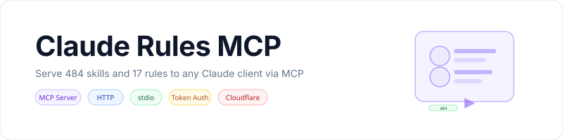

<p align="center">
    <picture>
        <source media="(prefers-color-scheme: dark)" srcset="art/banner-dark.svg">
        <source media="(prefers-color-scheme: light)" srcset="art/banner-light.svg">
        
    </picture>
</p>

<p align="center">
Serve 484 skills and 17 rules to any Claude client via MCP
</p>

<p align="center">
<a href="https://www.npmjs.com/package/claude-rules-mcp"></a>
<a href="https://www.npmjs.com/package/claude-rules-mcp"></a>
<a href="https://github.com/jeremykenedy/claude-rules-mcp-server/actions/workflows/tests.yml"></a>

<a href="LICENSE"></a>
</p>

## Table of Contents

- [About](#about)
- [Features](#features)
- [Requirements](#requirements)
- [Installation](#installation)
- [Quick Start](#quick-start)
- [Tools](#tools)
- [Configuration](#configuration)
- [Docker Deployment](#docker-deployment)
- [Claude Desktop Setup](#claude-desktop-setup)
- [Claude.ai Web Setup](#claudeai-web-setup)
- [Testing](#testing)
- [License](#license)

## About

An MCP (Model Context Protocol) server that reads Claude Code skills and rules from the filesystem and exposes them as tools. Supports HTTP and stdio transports with optional token authentication and Cloudflare Tunnel for remote access.

## Features

- Serves 484 skills with progressive disclosure (metadata first, full content on demand)
- 17 global rules accessible individually or concatenated
- Project-level rule discovery across multiple repositories
- Keyword search across all skills and rules
- Monitor summary integration (Gmail and court monitors)
- Token authentication for HTTP transport
- Dual transport: HTTP for containers/web, stdio for Claude Desktop

## Requirements

- Node.js 20+
- npm 10+
- Docker (for container deployment)

## Installation

### npm (recommended)

```bash
npm install claude-rules-mcp
```

Or run directly without installing:

```bash
npx claude-rules-mcp init
```

### Manual

```bash
git clone https://github.com/jeremykenedy/claude-rules-mcp-server.git
cd claude-rules-mcp-server
npm install
npm run build
```

## Quick Start

Run the interactive setup wizard:

```bash
npx claude-rules-mcp init
```

The wizard walks through transport selection, paths, and token auth. It creates a `.env` file with your configuration.

Then start the server:

```bash
npx claude-rules-mcp run
```

## Tools

| Tool | Description |
|------|-------------|
| `rules_get_manifest` | Returns the full skills manifest (names and descriptions, not file contents) |
| `rules_list_skills` | Lists all skills with optional keyword filter |
| `rules_get_skill` | Reads the full SKILL.md for a specific skill by name |
| `rules_get_skill_references` | Lists and reads reference files for a skill |
| `rules_list_global_rules` | Lists all 17 global rule names |
| `rules_get_global_rule` | Reads a specific global rule by name |
| `rules_get_global` | Concatenates all 17 rule files into one response |
| `rules_get_project` | Reads project-level CLAUDE.md and .claude/rules/ |
| `rules_list_projects` | Scans for projects with .claude/ directories |
| `rules_search` | Keyword search across skill descriptions and rule contents |
| `read_monitor_summary` | Reads the latest Gmail/court monitor summary |

## Configuration

| Variable | Default | Description |
|----------|---------|-------------|
| `TRANSPORT` | `stdio` | `http` or `stdio` |
| `PORT` | `3456` | HTTP port |
| `CLAUDE_DATA_PATH` | `/data/.claude` | Path to skills, rules, and manifest |
| `CLAUDE_PROJECTS_DIR` | `/data/sites` | Path to project directories |
| `MCP_SECRET` | (none) | Token for HTTP authentication (recommended for remote) |

## Docker Deployment

```bash
docker build -t claude-rules-mcp:latest .

docker run -d \
  --name claude-rules-mcp \
  --restart unless-stopped \
  -p 3456:3456 \
  -e TRANSPORT=http \
  -e PORT=3456 \
  -e CLAUDE_DATA_PATH=/data/.claude \
  -e CLAUDE_PROJECTS_DIR=/data/sites \
  -e MCP_SECRET=your-secret-token \
  -v /path/to/.claude:/data/.claude:ro \
  -v /path/to/sites:/data/sites:ro \
  claude-rules-mcp:latest
```

Health check:

```bash
curl http://localhost:3456/health
```

## Claude Desktop Setup

Add to `~/Library/Application Support/Claude/claude_desktop_config.json`:

```json
{
  "mcpServers": {
    "claude-rules": {
      "command": "npx",
      "args": ["-y", "claude-rules-mcp", "run"]
    }
  }
}
```

For remote via SSH:

```json
{
  "mcpServers": {
    "claude-rules": {
      "command": "ssh",
      "args": [
        "user@your-server",
        "cd /path/to/server && TRANSPORT=stdio node dist/index.js"
      ]
    }
  }
}
```

## Claude.ai Web Setup

Settings > Customize > Connectors > + > Add custom connector:

```
Name: Claude Rules
URL: https://your-domain.com/mcp?token=your-secret-token
```

## Testing

```bash
# Health check
curl http://localhost:3456/health

# Test with token
curl -X POST "http://localhost:3456/mcp?token=your-token" \
  -H "Content-Type: application/json" \
  -H "Accept: application/json, text/event-stream" \
  -d '{"jsonrpc":"2.0","id":1,"method":"initialize","params":{"protocolVersion":"2024-11-05","capabilities":{},"clientInfo":{"name":"test","version":"1.0.0"}}}'
```

## License

This package is open-sourced software licensed under the [MIT license](LICENSE).
